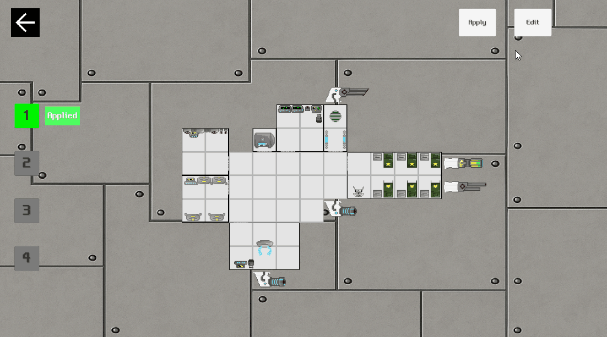

# Procedural Outer Hull

함선에 배치된 방의 점유 타일을 분석해 직선·외부 모서리·내부 모서리 외갑판을 자동으로 구성하는 시스템입니다.

배치 계산을 Unity 오브젝트 생성과 분리해 방향 판정과 결과 생성을 독립적으로 테스트할 수 있습니다.

## 시연

함선에 배치된 방의 형태를 분석해 직선·외부 모서리·내부 모서리 중 적절한 외갑판을 자동으로 선택하고 생성합니다.

## 처리 흐름

`방 점유 타일 입력 → 좌표 유효성 검사 → 직선·외부·내부 모서리 판정 → 중복 제거 → 배치 결과 반환`

## 파일별 설명

### [`OuterHullPlacementCalculator.cs`](OuterHullPlacementCalculator.cs)

- `Calculate`: 점유 타일과 그리드 크기를 받아 위치별 외갑판 배치 결과를 반환합니다.
- `AddStraightPlacements`: 방과 인접한 빈 타일에 반대 방향의 직선 외갑판을 배치합니다.
- `AddOuterCornerPlacements`: 대각선 후보와 두 직교 방향이 모두 비어 있는 외부 모서리를 찾습니다.
- `AddInnerCornerPlacements`: 두 방 사이의 오목한 빈 타일에 내부 모서리를 배치합니다.
- `OuterCornerRule`·`InnerCornerRule`: 방향 조합을 조건문 대신 룰 테이블로 표현합니다.
- `HashSet<HullPlacement>`: 동일 위치의 같은 형태·방향이 중복되지 않도록 처리합니다.
- `ShouldUseVariation`: 좌표와 seed를 사용해 직선 변형을 항상 같은 결과로 선택합니다.
- `HullPlacement`: 형태와 방향을 불변 값으로 보관하고 스프라이트 인덱스를 계산합니다.

### [`OuterHullPlacementCalculatorTests.cs`](OuterHullPlacementCalculatorTests.cs)

- 단일 방 타일의 직선·외부 모서리 생성
- 인접한 방 사이의 외갑판 생성 방지
- L자 배치의 내부 모서리 생성과 중복 제거
- 그리드 경계 밖 배치 방지
- 형태·방향별 스프라이트 인덱스 범위
- 동일 seed의 직선 변형 결과 재현

## 방향과 스프라이트 규칙

| 형태 | 인덱스 | 방향 순서 |
|---|---:|---|
| 직선 기본 | 0–3 | 하, 좌, 상, 우 |
| 직선 변형 | 4–7 | 하, 좌, 상, 우 |
| 외부 모서리 | 8–11 | 하좌, 상좌, 상우, 하우 |
| 내부 모서리 | 12–15 | 하좌, 상좌, 상우, 하우 |

## 계산 특성

점유 타일 수를 N이라고 할 때 각 타일에서 고정된 수의 방향만 검사하므로 계산량은 O(N), 추가 공간은 O(N)입니다. 배치 계산은 GameObject나 전역 난수 상태에 의존하지 않아 별도로 테스트할 수 있습니다.
