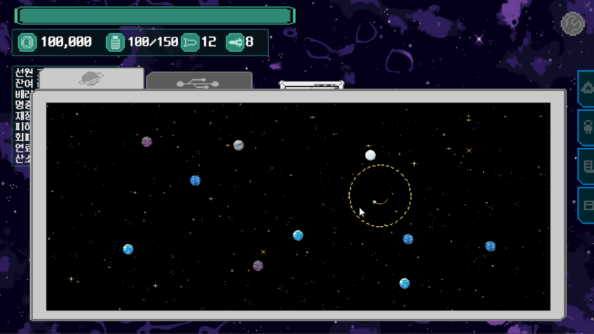

# Procedural Warp Graph

경로 노드 수와 레이어별 위험 정보를 받아 플레이어가 선택할 수 있는 워프 경로를 생성하고 Unity UI로 표시하는 시스템입니다.

그래프 계산을 화면 오브젝트 생성과 분리해 연결 규칙을 독립적으로 검증할 수 있습니다.

## 시연

여행 경로가 정해지면 경로 길이에 맞춰 워프 맵의 레이어별 노드와 선택 가능한 이동 경로를 생성합니다.

## 처리 흐름

`경로 노드 수 입력 → 레이어별 노드 생성 → 인접 레이어 연결 → UI 노드 배치 → 연결선 생성 → 노드 선택 전달`

1. `GenerateTreeFromPath`가 경로의 노드 수를 워프 트리의 레이어 수로 사용하고 위험 정보를 복사합니다.
2. `WarpGraphGenerator`가 시작·도착 노드와 중간 레이어의 분기 노드를 생성합니다.
3. 각 중간 노드에 해적, 우주 정거장, 랜덤 이벤트 타입을 확률에 따라 지정합니다.
4. 인접 레이어의 노드 수 비율로 각 노드의 연결 구간을 계산합니다.
5. 구간 안에서 경로를 선택하고 모든 노드가 진입·진출 경로를 갖도록 연결합니다.
6. `EventTreeMap`이 생성 결과를 UI 노드로 배치하고 위험 여부와 이벤트 타입에 맞는 색상을 적용합니다.
7. `WarpGraphLineView`가 노드 가장자리 사이에 연결선을 그리고, `EventTreeMap`이 선택된 노드를 외부 시스템에 전달합니다.

## 파일별 설명

### [`WarpGraphGenerator.cs`](WarpGraphGenerator.cs)

- `Generate`: 레이어 수, 위험 정보, seed를 받아 노드와 간선 데이터를 반환합니다.
- `DetermineNodeCount`: 시작과 도착을 단일 노드로 만들고 중간 레이어의 노드 수를 결정합니다.
- `DetermineNodeType`: 일반 레이어와 도착 직전 레이어에 서로 다른 이벤트 타입 확률을 적용합니다.
- `GetConnectionRange`: 노드 수 비율로 교차하지 않는 연결 후보 구간을 계산합니다.
- `AddOutgoingConnections`: 각 노드의 진출 경로와 같은 구간 안의 추가 분기를 생성합니다.
- `AddMissingIncomingConnections`: 진입 경로가 없는 노드를 인덱스상 가까운 이전 노드에 연결합니다.

### [`EventTreeMap.cs`](EventTreeMap.cs)

그래프 생성 결과를 Unity UI로 변환합니다. 노드 위치와 색상 설정, 연결 데이터 적용, 선택 이벤트 전달을 담당합니다. 고정 seed를 사용하면 같은 트리를 다시 생성할 수 있습니다.

### [`WarpGraphLineView.cs`](WarpGraphLineView.cs)

그래프의 간선을 UI 연결선으로 표시합니다. 노드 중심이 아닌 사각 영역의 가장자리를 연결하고, 기존 연결선을 제거한 뒤 현재 그래프를 다시 그립니다.

### [`EventNode.cs`](EventNode.cs)

레이어 인덱스, 레이어 내부 인덱스, 위험 지역 여부와 다음 레이어의 연결 노드를 보관합니다. 연결 목록은 읽기 전용으로 제공하며 동일 목적지의 중복 연결을 방지합니다.

### [`WarpGraphGeneratorTests.cs`](WarpGraphGeneratorTests.cs)

- 시작과 도착 레이어의 단일 노드 구성
- 레이어별 위험 정보 적용
- 모든 노드의 진입·진출 경로 보장
- 인접 레이어 연결선의 교차 여부
- 동일 seed의 생성 결과 재현

## 그래프 구성 규칙

- 시작과 도착 레이어는 단일 노드로 구성
- 시작·도착과 가까운 중간 레이어는 최대 세 개의 노드로 제한
- 노드의 세로 순서와 레이어 간 노드 수 비율로 연결 구간 계산
- 모든 노드에 다음 레이어로 향하는 경로 확보
- 시작 레이어를 제외한 모든 노드에 이전 레이어의 진입 경로 확보
- 동일 seed와 입력에서 같은 노드 구성과 연결 결과 생성
