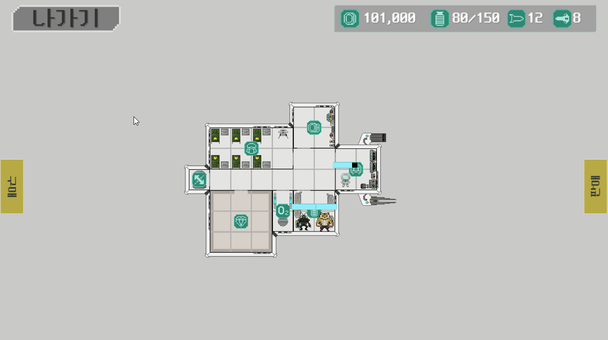

# Grid Cargo Inventory

5×5 형태 데이터로 불규칙한 화물의 회전별 점유 영역을 계산하고, 함선 창고의 격자에 배치 가능한지 판정하는 시스템입니다.

## 시연

화물을 드래그 앤 드롭으로 격자에 배치하고 회전할 수 있으며, 경계 이탈과 다른 화물과의 겹침을 프리뷰로 확인합니다.

## 처리 흐름

`기본 형태 좌표 → 회전별 점유 좌표 생성 → 마우스 월드 좌표 → 창고 격자 좌표 변환 → 점유 타일 계산 → 경계·충돌·보관 타입 검사 → 프리뷰 위치 갱신`

## 파일별 설명

### [`ItemShape.cs`](ItemShape.cs)

- `GridSize`·`CenterIndex`: 형태 데이터의 크기와 배치 기준점을 한곳에서 정의합니다.
- `baseShapes`: 14개 화물의 기본 점유 형태를 중심 기준 상대 좌표로 표현합니다.
- `CreateRotations`: 기본 형태의 각 좌표를 90도씩 회전해 네 방향의 점유 좌표를 생성합니다.
- `GetOccupiedOffsets`: 형태 ID와 회전 상태에 대응하는 읽기 전용 좌표 목록을 반환합니다.

기본 형태만 관리하고 회전 결과는 계산으로 생성하므로 방향별 데이터를 중복해서 작성하지 않습니다.

### [`StorageRoomBase.cs`](StorageRoomBase.cs)

- `Initialize`: 창고 크기에 맞는 아이템 점유 배열을 생성합니다.
- `CanPlaceItem`: 회전된 화물의 모든 점유 타일을 대상으로 창고 경계, 다른 화물과의 충돌, 보관 가능한 아이템 타입을 검사합니다.
- `GetOccupiedTiles`: 회전된 상대 좌표를 배치 기준점에 더해 실제 창고 점유 타일로 변환합니다.
- `WorldToGridPosition`: 마우스의 월드 위치를 회전과 이동이 적용된 창고의 로컬 격자 좌표로 변환합니다.
- `GridToWorldPosition`: 격자 좌표의 셀 중심을 창고의 월드 좌표로 변환합니다.

현재 배치된 아이템 자신이 차지한 칸은 충돌에서 제외하므로 같은 창고 안에서 위치나 회전을 미리 검사할 수 있습니다.

### [`TradingItemDragHandler.cs`](TradingItemDragHandler.cs)

- `UpdatePreviewPosition`: 마우스 아래의 창고를 찾고 해당 창고의 격자에 프리뷰를 맞춥니다.
- `UpdatePreviewToGridPosition`: 불규칙한 점유 타일의 최소·최대 좌표로 시각적 중심을 계산합니다.
- `GetStorageUnderMouse`: 점 위치의 2D 콜라이더에서 대상 창고를 조회합니다.

창고 밖에서는 프리뷰가 마우스를 따라가고, 창고 안에서는 회전된 화물이 차지할 영역의 중심에 맞춰 표시됩니다.

## 배치 규칙

- 화물 형태는 `GridSize = 5`, `CenterIndex = 2`인 좌표계로 표현
- 기본 형태의 상대 좌표를 90도씩 회전해 네 방향 생성
- 하나라도 창고 경계를 벗어나면 배치 불가
- 다른 화물이 점유한 타일과 겹치면 배치 불가
- 창고 종류가 해당 화물 분류를 지원해야 배치 가능
- 월드 좌표 변환에 창고 Transform 반영
