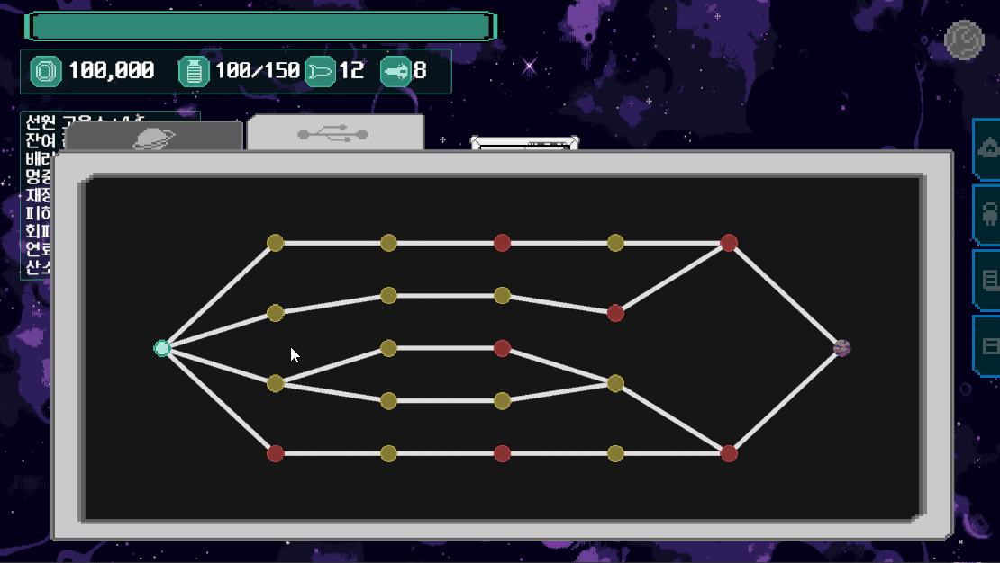

# 데이터 기반 랜덤 이벤트

함선·행성·미스터리 이벤트를 `ScriptableObject` 데이터로 정의하고, 현재 게임 상태에 맞는 이벤트를 선택해 순서대로 실행하는 시스템입니다.

## 시연

이벤트 노드를 선택해 여행하면 조건에 맞는 랜덤 이벤트와 조우하고, 선택한 결과가 게임 상태에 반영됩니다.

## 처리 흐름

1. `EventDatabase`가 중복 ID를 제외한 이벤트를 ID·발생 타입·결과 성향별로 인덱싱합니다.
2. 연도, COMA, 연료, 보유 선원 종족을 모두 만족하는 후보를 필터링합니다.
3. 이벤트가 동시에 요청되면 `EventManager`의 큐에 넣어 하나씩 UI에 표시합니다.
4. 플레이어가 선택지를 고르면 `EventChoice`가 설정된 가중치에 따라 결과를 선택합니다.
5. 결과를 자원·선원·행성·특수 효과 핸들러로 나누어 적용합니다.

## 주요 코드

### [`RandomEvent.cs`](RandomEvent.cs)

이벤트 본문, 분류, 발생 조건, 선택지를 한 데이터 자산에 구성합니다. 게임 로직과 이벤트 콘텐츠를 분리해 새 이벤트를 코드 변경 없이 추가할 수 있습니다.

### [`EventDatabase.cs`](EventDatabase.cs) · [`EventEligibility.cs`](EventEligibility.cs)

중복 ID를 검사하며 모든 조회가 같은 유효 이벤트 집합을 사용하도록 인덱스를 구성합니다. 복합 조건 필터는 발생 타입 인덱스에서 후보를 가져온 뒤 이벤트가 요구하는 모든 선원 종족을 보유했는지 확인합니다.

### [`EventChoice.cs`](EventChoice.cs) · [`EventOutcome.cs`](EventOutcome.cs)

선택지 하나가 여러 결과와 가중치를 가질 수 있습니다. 고정된 100을 전제하지 않고 유효한 가중치의 합을 기준으로 추첨하며, 결과에는 여러 종류의 일반 효과와 특수 효과를 함께 구성할 수 있습니다. 정규화된 값을 받는 선택 경로로 경계 조건을 재현할 수 있습니다.

### [`EventManager.cs`](EventManager.cs)

이벤트 요청을 큐로 직렬화하고, 현재 이벤트가 끝난 뒤 다음 이벤트를 표시합니다. UI가 늦게 연결되면 보존된 큐를 이어서 처리합니다. 선택 결과의 실제 처리는 효과 종류별 핸들러와 특수 효과 팩토리에 위임합니다.

### [`ISpecialEffectHandler.cs`](ISpecialEffectHandler.cs) · [`TeleportEffectHandler.cs`](TeleportEffectHandler.cs)

특수 효과의 공통 실행 계약과 랜덤 행성 이동 구현입니다. 행성 데이터가 있는지 확인한 뒤 워프 경로와 대기 이벤트를 정리하고, 목적 행성과 함선 위치를 갱신합니다.

### [`EventSystemTests.cs`](EventSystemTests.cs)

선원 종족 조건과 가중치 합계 기반 결과 선택을 Unity Test Framework로 검증합니다.

## 설계 요점

- 이벤트 콘텐츠와 실행 로직의 분리
- 중복을 제거한 동일 데이터 집합과 타입 인덱스를 통한 반복 검색 축소
- 여러 조건을 한 번에 적용하는 후보 필터
- 중첩된 이벤트 요청을 보존하는 FIFO 큐
- 효과 종류별 핸들러 분배
