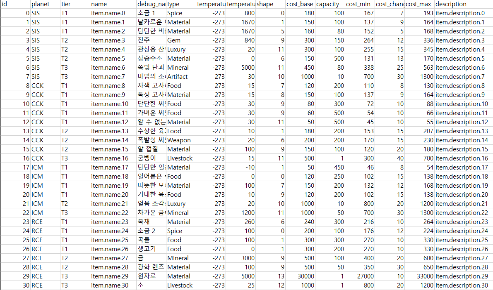
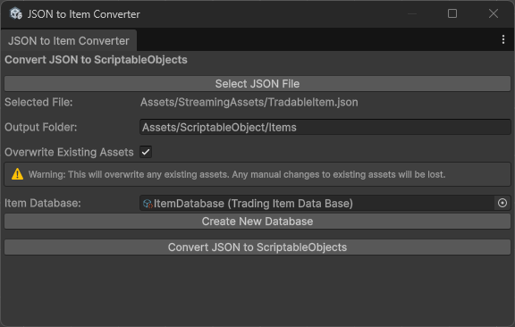
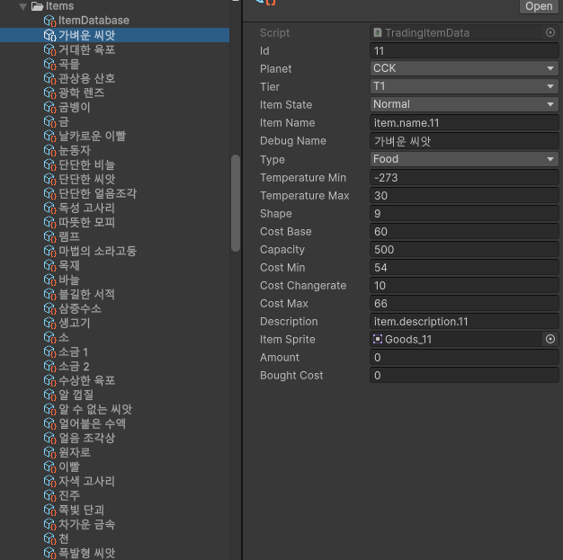
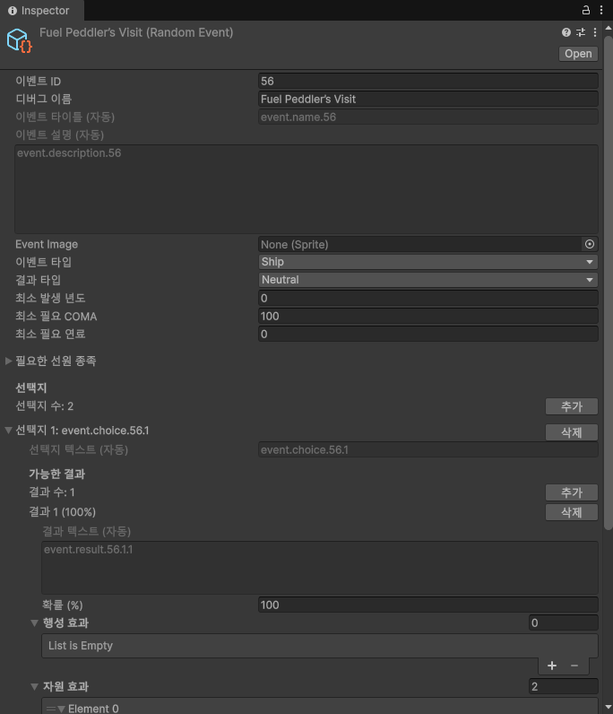

# Data Authoring Pipeline

화물·장비·함선 무기·현지화 데이터를 CSV에서 관리하고, Unity가 사용하는 JSON과 `ScriptableObject`로 연결하는 데이터 제작 파이프라인입니다.

기획자가 코드를 수정하지 않고 표의 수치를 변경할 수 있으며, 생성 데이터와 Unity 에셋의 수작업 불일치를 줄입니다. 이벤트 콘텐츠는 커스텀 인스펙터에서 선택지와 결과를 구성하고 확률 합계를 즉시 검증할 수 있습니다.

## 데이터 제작 흐름

### CSV 편집



기획자가 화물의 가격, 적재량, 등장 행성, 온도 조건과 같은 밸런스 데이터를 CSV에서 직접 편집합니다.

```text
CSV 데이터 편집
  → GitHub Actions 변경 감지
  → Python 변환 스크립트 실행
  → StreamingAssets JSON 갱신
  → Unity Editor Importer 실행
  → ID 기준 ScriptableObject 생성·업데이트
  → 게임 데이터베이스 등록
```

### Unity Importer



변환된 JSON과 출력 폴더를 지정해 `ScriptableObject` 생성·갱신을 실행합니다. 같은 ID의 에셋은 새로 만들지 않고 기존 에셋의 데이터를 갱신합니다.

### 변환 결과



생성된 화물 에셋은 Unity Inspector에서 확인할 수 있으며, 데이터베이스에 등록해 게임에서 사용합니다.

## 이벤트 제작 도구

```text
이벤트 조건·선택지·결과 입력
  → 결과 확률 합계 검사
  → 필요 시 확률 균등 분배
  → JSON 가져오기·내보내기
  → 이벤트 ScriptableObject 반영
```



기획자가 Unity Editor에서 이벤트의 등장 조건, 선택지, 결과 확률과 효과를 구성할 수 있습니다. 결과 확률의 합계를 편집 단계에서 검사하고 필요하면 균등하게 재분배합니다.

## 주요 코드

### [`DataPipeline.yml`](DataPipeline.yml)

CSV 변경이 main 브랜치에 반영되면 Python 환경을 구성하고 변환 스크립트를 실행합니다. 생성된 JSON은 `StreamingAssets`로 복사한 뒤 변경이 있을 때만 저장소에 반영합니다.

### [`csv_to_json.py`](csv_to_json.py)

`DataSheet`의 CSV 파일을 일괄 탐색해 행 인덱스 기반 JSON으로 변환합니다. 파일명은 데이터 종류를 구분하는 출력 이름으로 사용하고 한글을 포함한 문자열을 UTF-8로 보존합니다.

### [`TradingItemDataImporter.cs`](TradingItemDataImporter.cs)

화물 ID로 기존 `ScriptableObject`를 먼저 조회합니다. 같은 ID가 있으면 기존 에셋 인스턴스를 갱신해 다른 오브젝트의 참조를 유지하고, 없는 ID만 새 에셋으로 생성합니다. 변환이 끝나면 데이터베이스 목록과 Unity `AssetDatabase`를 함께 갱신합니다.

화물에 적용한 패턴을 장비와 함선 무기 데이터에도 확장했습니다.

### [`EventProbabilityValidator.cs`](EventProbabilityValidator.cs)

이벤트 선택지에 연결된 결과 확률을 합산하고 100%에서 벗어나면 경고를 표시합니다. 버튼 한 번으로 결과 수에 맞춰 확률을 균등 분배하며, 결과가 없는 경우를 먼저 검사합니다.

## 설계 요점

- 코드와 밸런스 데이터의 변경 경로 분리
- CSV에서 런타임 JSON까지 이어지는 자동 변환
- ID 기반 갱신으로 기존 Unity 에셋 참조 유지
- 신규 데이터만 `ScriptableObject`로 생성
- 이벤트 결과 확률의 편집 단계 검증
- 팀원이 수정한 CSV와 자동 생성된 JSON의 이력 분리
